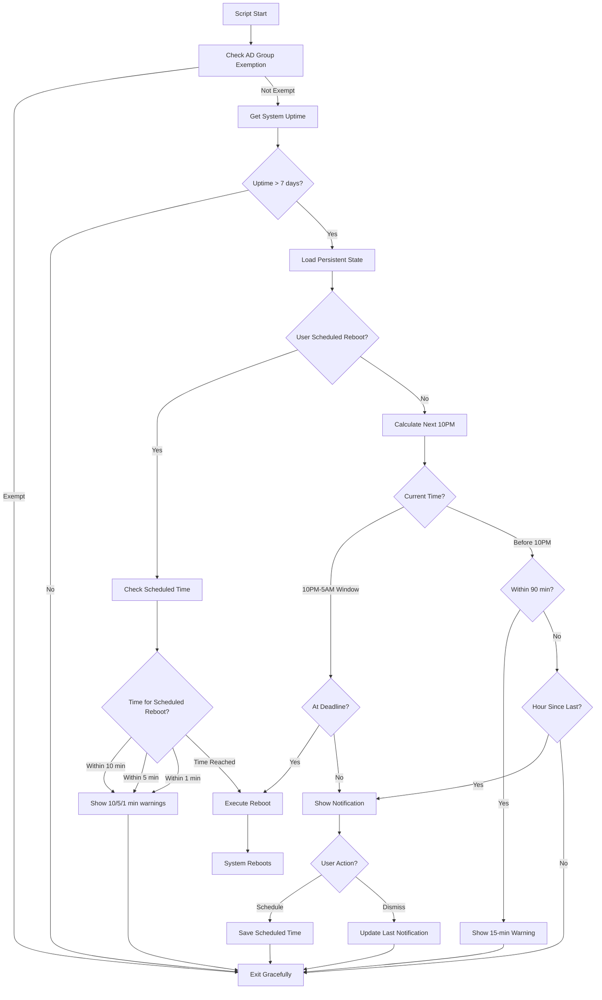

# Forced Reboot Enforcement Script - Architecture Plan

## Overview
PowerShell script to enforce periodic workstation reboots after 7 days of uptime, with progressive user notifications and scheduling options.

## Core Requirements

### Uptime Threshold
- **Trigger**: 7 days (168 hours) of continuous uptime
- **Action Start**: Day 8 (after 168 hours)
- **Force Reboot Window**: 10PM - 5AM local time only

### Notification Strategy

#### Day 8+ (Initial Phase)
- **First notification**: Inform user of 7-day uptime exceeded
- **Frequency**: Every hour
- **Content**: 
  - Current uptime
  - Next 10PM deadline
  - Hours until deadline
  - Option to schedule reboot

#### Final 90 Minutes
- **Frequency**: Every 15 minutes
- **Content**: Countdown with urgency

#### Scheduled Reboot
- **User Choice**: Can schedule any time before 10PM deadline
- **Reminders**: 10, 5, 1 minute before scheduled time
- **Storage**: Persistent across script runs

### Exemption Mechanism
- **Method**: AD group membership check
- **Behavior**: Graceful exit if member of exemption group
- **No logging spam**: Check happens early, minimal logs

---

## Script Parameters

```powershell
param(
    [Parameter(Mandatory=$false)]
    [string]$ExemptionADGroup = "RebootExemption",
    
    [Parameter(Mandatory=$false)]
    [string]$LogPath = "$env:ProgramData\RebootEnforcement\logs",
    
    [Parameter(Mandatory=$false)]
    [int]$UptimeThresholdDays = 7,
    
    [Parameter(Mandatory=$false)]
    [int]$RebootHour = 22,  # 10PM
    
    [Parameter(Mandatory=$false)]
    [int]$RebootWindowEnd = 5,  # 5AM
    
    [Parameter(Mandatory=$false)]
    [switch]$WhatIf,
    
    # Demo/Testing Parameters
    [Parameter(Mandatory=$false)]
    [switch]$DemoMode,
    
    [Parameter(Mandatory=$false)]
    [int]$DemoUptimeDays = 8,  # Simulated uptime in demo mode
    
    [Parameter(Mandatory=$false)]
    [int]$DemoMinutesToDeadline = 15,  # Minutes until simulated deadline
    
    [Parameter(Mandatory=$false)]
    [switch]$SkipADCheck  # Skip AD group check for testing
)
```

---

## Architecture Components

### 1. AD Group Exemption Check
**Function**: `Test-RebootExemption`
- Query computer's AD group membership
- Exit codes:
  - Exit 0: Exempt (graceful, minimal logging)
  - Continue: Not exempt
- Implementation: `Get-ADComputer` with `-Properties MemberOf`

### 2. Uptime Calculation
**Function**: `Get-SystemUptime`
- Use: `(Get-CimInstance Win32_OperatingSystem).LastBootUpTime`
- Returns: TimeSpan object
- Comparison: Against threshold (7 days = 168 hours)

### 3. Deadline Calculation
**Function**: `Get-NextRebootDeadline`
- Calculate next valid 10PM occurrence
- Logic:
  ```
  If current time < 10PM today → deadline = today 10PM
  If current time >= 10PM and < 5AM → deadline = today 10PM (already in window)
  If current time >= 5AM → deadline = today 10PM
  ```
- Returns: DateTime object for next 10PM

### 4. Persistent State Management
**Storage Location**: Registry or JSON file
- **Recommended**: `HKLM:\SOFTWARE\RebootEnforcement`
- **Keys**:
  - `LastNotificationTime`: DateTime
  - `ScheduledRebootTime`: DateTime (nullable)
  - `UserScheduledReboot`: Boolean
  - `NotificationCount`: Integer

**Alternative**: JSON file at `$env:ProgramData\RebootEnforcement\state.json`

### 5. Toast Notification System

#### Option A: BurntToast Module (Recommended)
**Pros**:
- Rich, interactive notifications
- Button support
- Easy text input
- Well-maintained

**Installation Check**:
```powershell
if (-not (Get-Module -ListAvailable BurntToast)) {
    Install-Module -Name BurntToast -Force -Scope AllUsers
}
```

**Sample Notification**:
```powershell
New-BurntToastNotification -Text "Title", "Message" `
    -Button (New-BTButton -Content "Schedule" -Arguments "schedule") `
    -AppLogo "C:\Path\Logo.png"
```

#### Option B: Native Windows.UI.Notifications
**Pros**:
- No dependencies
- Built into Windows 10+

**Cons**:
- More complex XML construction
- Interactive buttons require protocol handlers

**Recommendation**: Use BurntToast for easier implementation

### 6. Notification Types

#### A. Initial Warning (Day 8+)
```
Title: "Reboot Required"
Message: "Your computer has been running for 8 days. 
         A reboot will be forced at 10:00 PM (X hours from now).
         Click 'Schedule' to choose a time or 'Remind Me' to continue."
Buttons: [Schedule Reboot] [Remind Me in 1 Hour]
```

#### B. Hourly Reminder
```
Title: "Reboot Reminder"
Message: "Forced reboot in X hours at 10:00 PM.
         Current uptime: Y days."
Buttons: [Schedule Reboot] [OK]
```

#### C. Final 90-Minute Warnings
```
Title: "⚠️ Urgent: Reboot in X Minutes"
Message: "Your computer will restart in X minutes at 10:00 PM.
         Please save your work immediately."
Buttons: [Save & Restart Now] [OK]
```

#### D. Scheduled Countdown
```
Title: "Scheduled Reboot in X Minutes"
Message: "Your scheduled reboot will begin in X minutes.
         Please save your work."
Buttons: [Restart Now] [OK]
```

### 7. User Scheduling

#### Scheduling Dialog
- **Input**: Custom time picker using Windows Forms
- **Interface**: DateTimePicker control set to time-only mode
- **Validation**:
  - Must be before 10PM deadline
  - Must be in future
  - Within current day (or early morning if in 10PM-5AM window)
- **Storage**: Save to registry/JSON

#### Implementation with Windows Forms
```powershell
function Show-RebootScheduler {
    param([DateTime]$Deadline)
    
    Add-Type -AssemblyName System.Windows.Forms
    Add-Type -AssemblyName System.Drawing
    
    $form = New-Object System.Windows.Forms.Form
    $form.Text = 'Schedule Reboot'
    $form.Size = New-Object System.Drawing.Size(400,200)
    $form.StartPosition = 'CenterScreen'
    $form.FormBorderStyle = 'FixedDialog'
    $form.MaximizeBox = $false
    
    # Label
    $label = New-Object System.Windows.Forms.Label
    $label.Location = New-Object System.Drawing.Point(10,20)
    $label.Size = New-Object System.Drawing.Size(370,40)
    $label.Text = "Choose a time to restart (must be before $($Deadline.ToString('h:mm tt')))"
    $form.Controls.Add($label)
    
    # Time picker
    $timePicker = New-Object System.Windows.Forms.DateTimePicker
    $timePicker.Location = New-Object System.Drawing.Point(100,70)
    $timePicker.Size = New-Object System.Drawing.Size(200,20)
    $timePicker.Format = 'Time'
    $timePicker.ShowUpDown = $true
    $timePicker.Value = (Get-Date).AddHours(1)
    $form.Controls.Add($timePicker)
    
    # OK Button
    $okButton = New-Object System.Windows.Forms.Button
    $okButton.Location = New-Object System.Drawing.Point(100,110)
    $okButton.Size = New-Object System.Drawing.Size(75,23)
    $okButton.Text = 'Schedule'
    $okButton.DialogResult = 'OK'
    $form.AcceptButton = $okButton
    $form.Controls.Add($okButton)
    
    # Cancel Button
    $cancelButton = New-Object System.Windows.Forms.Button
    $cancelButton.Location = New-Object System.Drawing.Point(225,110)
    $cancelButton.Size = New-Object System.Drawing.Size(75,23)
    $cancelButton.Text = 'Cancel'
    $cancelButton.DialogResult = 'Cancel'
    $form.CancelButton = $cancelButton
    $form.Controls.Add($cancelButton)
    
    $result = $form.ShowDialog()
    
    if ($result -eq 'OK') {
        $selectedTime = $timePicker.Value
        # Validate selected time is before deadline
        $todayScheduled = Get-Date -Hour $selectedTime.Hour -Minute $selectedTime.Minute -Second 0
        
        if ($todayScheduled -lt (Get-Date)) {
            # If selected time already passed today, invalid
            return $null
        }
        if ($todayScheduled -gt $Deadline) {
            # If selected time is after deadline, invalid
            return $null
        }
        
        return $todayScheduled
    }
    
    return $null
}
```

#### Toast Notification with Schedule Button
```powershell
# BurntToast notification with "Schedule" button that opens Windows Forms dialog
$buttons = @(
    New-BTButton -Content "Schedule Reboot" -Arguments "schedule"
    New-BTButton -Content "Remind Me Later" -Arguments "remind"
)
```

When user clicks "Schedule Reboot" button, the script will:
1. Display the Windows Forms time picker dialog
2. Validate the selected time
3. Save to registry if valid
4. Show confirmation notification

### 8. Reboot Execution

**Function**: `Invoke-SystemReboot`
- **Pre-check**: Verify time is in 10PM-5AM window
- **Command**: `Restart-Computer -Force`
- **Logging**: Full details before execution
- **WhatIf Support**: Skip actual reboot

```powershell
function Invoke-SystemReboot {
    param([switch]$WhatIf)
    
    $currentHour = (Get-Date).Hour
    if ($currentHour -ge 22 -or $currentHour -lt 5) {
        if ($WhatIf) {
            Write-Log "WhatIf: Would restart computer now"
        } else {
            Write-Log "Initiating system reboot"
            Restart-Computer -Force
        }
    } else {
        Write-Log "ERROR: Attempted reboot outside 10PM-5AM window"
    }
}
```

### 9. Logging System

**Function**: `Write-RebootLog`
- **Levels**: INFO, WARNING, ERROR, DEBUG (verbose)
- **Format**: `[TIMESTAMP] [LEVEL] Message`
- **File**: `$LogPath\RebootEnforcement_YYYYMMDD.log`
- **Rotation**: Daily log files

```powershell
function Write-RebootLog {
    param(
        [string]$Message,
        [ValidateSet('INFO','WARNING','ERROR','DEBUG')]
        [string]$Level = 'INFO'
    )
    
    $timestamp = Get-Date -Format "yyyy-MM-dd HH:mm:ss"
    $logMessage = "[$timestamp] [$Level] $Message"
    $logFile = Join-Path $LogPath "RebootEnforcement_$(Get-Date -Format 'yyyyMMdd').log"
    
    # Ensure directory exists
    if (-not (Test-Path $LogPath)) {
        New-Item -Path $LogPath -ItemType Directory -Force | Out-Null
    }
    
    Add-Content -Path $logFile -Value $logMessage
    
    # Also write to host with colors
    $color = switch ($Level) {
        'ERROR' { 'Red' }
        'WARNING' { 'Yellow' }
        'DEBUG' { 'Gray' }
        default { 'White' }
    }
    Write-Host $logMessage -ForegroundColor $color
}
```

---

## Execution Flow



---

## Notification Timing Logic

### Decision Tree for Notification Type

```powershell
function Get-NotificationType {
    param(
        [TimeSpan]$Uptime,
        [DateTime]$Deadline,
        [DateTime]$ScheduledTime,
        [DateTime]$LastNotification
    )
    
    $now = Get-Date
    $minutesUntilDeadline = ($Deadline - $now).TotalMinutes
    $hoursSinceLastNotification = ($now - $LastNotification).TotalHours
    
    # User has scheduled a reboot
    if ($ScheduledTime -ne $null -and $ScheduledTime -gt $now) {
        $minutesUntilScheduled = ($ScheduledTime - $now).TotalMinutes
        
        if ($minutesUntilScheduled -le 1) {
            return "ScheduledCountdown1"
        } elseif ($minutesUntilScheduled -le 5) {
            return "ScheduledCountdown5"
        } elseif ($minutesUntilScheduled -le 10) {
            return "ScheduledCountdown10"
        }
        return "None"
    }
    
    # Within final 90 minutes
    if ($minutesUntilDeadline -le 90) {
        if ($hoursSinceLastNotification -ge 0.25) {  # 15 minutes
            return "FinalWarning"
        }
        return "None"
    }
    
    # Standard hourly reminder
    if ($hoursSinceLastNotification -ge 1) {
        return "HourlyReminder"
    }
    
    return "None"
}
```

---

## Error Handling & Edge Cases

### 1. System Sleep/Hibernate
- **Issue**: Uptime doesn't account for sleep
- **Solution**: Accept as valid; uptime is uptime
- **Alternative**: Check `Get-WinEvent` for sleep/wake events (complex)

### 2. Daylight Saving Time
- **Issue**: Time jumps could affect deadline calculation
- **Solution**: Always use current local time; recalculate deadline each run

### 3. User Schedules Past Deadline
- **Validation**: Reject schedules >= 10PM or < current time
- **Feedback**: Show error in toast notification

### 4. Script Runs During 10PM-5AM Window
- **Check**: If uptime > 7 days AND in window
- **Action**: Immediate reboot (with 1-minute warning)

### 5. Computer Not Joined to Domain
- **AD Check**: Wrap in try/catch
- **Fallback**: Proceed without exemption check if AD unavailable

### 6. BurntToast Not Available
- **Fallback**: Use basic Windows Forms message boxes
- **Or**: Use native toast via COM/WinRT

---

## Testing Strategy

### Test Scenarios

1. **Uptime < 7 Days**: Script exits gracefully
2. **Uptime = 8 Days, 2PM**: Shows initial warning with schedule option
3. **Uptime = 8 Days, 9PM**: Shows warning, 1 hour to deadline
4. **Uptime = 8 Days, 9:30PM**: Shows 15-min warnings
5. **Uptime = 8 Days, 10PM**: Executes reboot
6. **User Schedules 8PM**: Shows countdowns at 7:50, 7:55, 7:59
7. **AD Group Member**: Exits immediately
8. **Run with -WhatIf**: Logs actions but doesn't reboot

### Demo Mode for Rapid Testing

**Purpose**: Allow demonstrations and testing without waiting for actual uptime thresholds or deadlines.

**Usage Examples**:

```powershell
# Demo: Show initial warning (8 days uptime, 15 minutes to deadline)
.\Invoke-RebootEnforcement.ps1 -DemoMode -DemoUptimeDays 8 -DemoMinutesToDeadline 15 -WhatIf

# Demo: Final warning phase (8 days uptime, 5 minutes to deadline)
.\Invoke-RebootEnforcement.ps1 -DemoMode -DemoUptimeDays 8 -DemoMinutesToDeadline 5 -WhatIf

# Demo: Immediate reboot scenario (in reboot window)
.\Invoke-RebootEnforcement.ps1 -DemoMode -DemoUptimeDays 10 -DemoMinutesToDeadline 0 -WhatIf

# Demo: User scheduling flow (plenty of time before deadline)
.\Invoke-RebootEnforcement.ps1 -DemoMode -DemoUptimeDays 8 -DemoMinutesToDeadline 120 -SkipADCheck -WhatIf

# Demo: Test scheduled reboot countdown (1 minute to scheduled time)
# First run creates schedule, second run with adjusted time shows countdown
.\Invoke-RebootEnforcement.ps1 -DemoMode -DemoUptimeDays 8 -DemoMinutesToDeadline 60 -WhatIf
```

**Demo Mode Implementation**:

```powershell
function Get-SystemUptimeForDemo {
    param([switch]$DemoMode, [int]$DemoUptimeDays)
    
    if ($DemoMode) {
        Write-RebootLog "DEMO MODE: Simulating $DemoUptimeDays days of uptime" -Level DEBUG
        return [TimeSpan]::FromDays($DemoUptimeDays)
    }
    
    # Real uptime calculation
    $os = Get-CimInstance Win32_OperatingSystem
    return (Get-Date) - $os.LastBootUpTime
}

function Get-NextRebootDeadlineForDemo {
    param([switch]$DemoMode, [int]$DemoMinutesToDeadline)
    
    if ($DemoMode) {
        $simulatedDeadline = (Get-Date).AddMinutes($DemoMinutesToDeadline)
        Write-RebootLog "DEMO MODE: Deadline set to $simulatedDeadline ($DemoMinutesToDeadline minutes from now)" -Level DEBUG
        return $simulatedDeadline
    }
    
    # Real deadline calculation (next 10PM)
    # ... actual logic here
}
```

**Demo Mode Features**:
- ✅ Override uptime check
- ✅ Override deadline calculation
- ✅ Skip AD group check (optional via -SkipADCheck)
- ✅ Automatically enables WhatIf internally to prevent actual reboots
- ✅ Show all notifications in compressed timeframe
- ✅ Log clearly indicates DEMO MODE active
- ✅ Test all notification types rapidly

**Safety**: Demo mode automatically enables WhatIf behavior for reboot commands to prevent accidental reboots during demos.

---

## Deployment Considerations

### SCCM Configuration
- **Collection**: All workstations NOT in exemption AD group
- **Schedule**: Run every 15 minutes during business hours
- **Schedule**: Run every 5 minutes during 9PM-11PM window
- **Run As**: SYSTEM (for reboot privileges)
- **Detection**: None (always runs, self-determines action)

### ServiceNow Integration
- **Exemption Management**: ServiceNow creates/removes AD group memberships
- **Reporting**: Export logs to central location for analysis
- **Metrics**: Track reboot compliance

---

## File Structure

```
RebootEnforcement/
├── Invoke-RebootEnforcement.ps1    # Main script
├── README.md                         # Documentation
└── Logs/                            # Created at runtime
    └── RebootEnforcement_YYYYMMDD.log
```

---

## Sample Output

### Console Log (Verbose)
```
[2025-01-15 14:30:00] [INFO] Reboot Enforcement Script Started
[2025-01-15 14:30:00] [INFO] Checking AD exemption status...
[2025-01-15 14:30:01] [INFO] Computer is not exempt from reboot policy
[2025-01-15 14:30:01] [INFO] System uptime: 8 days, 6 hours, 22 minutes
[2025-01-15 14:30:01] [INFO] Uptime exceeds threshold of 7 days
[2025-01-15 14:30:01] [INFO] Next reboot deadline: 2025-01-15 22:00:00 (7.5 hours)
[2025-01-15 14:30:01] [INFO] Last notification: Never
[2025-01-15 14:30:01] [INFO] Displaying initial warning notification
[2025-01-15 14:30:02] [INFO] Notification shown successfully
[2025-01-15 14:30:02] [INFO] Script execution completed
```

---

## Implementation Priority

1. ✅ Core uptime check
2. ✅ AD exemption logic  
3. ✅ Deadline calculation
4. ✅ Logging framework
5. ✅ Basic toast notifications (BurntToast)
6. ✅ Notification timing logic
7. ✅ Persistent state management
8. ✅ User scheduling feature
9. ✅ Scheduled reboot countdowns
10. ✅ Force reboot execution
11. ✅ WhatIf support
12. ✅ Error handling
13. ✅ Testing & validation

---

## Next Steps

This architecture plan provides a comprehensive foundation for implementing the reboot enforcement script. The design balances user experience (multiple warnings, scheduling options) with business requirements (enforce reboots after 7 days).

**Ready to proceed to Code mode for implementation?**